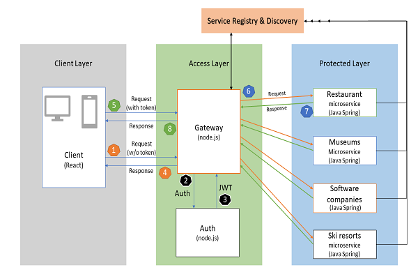
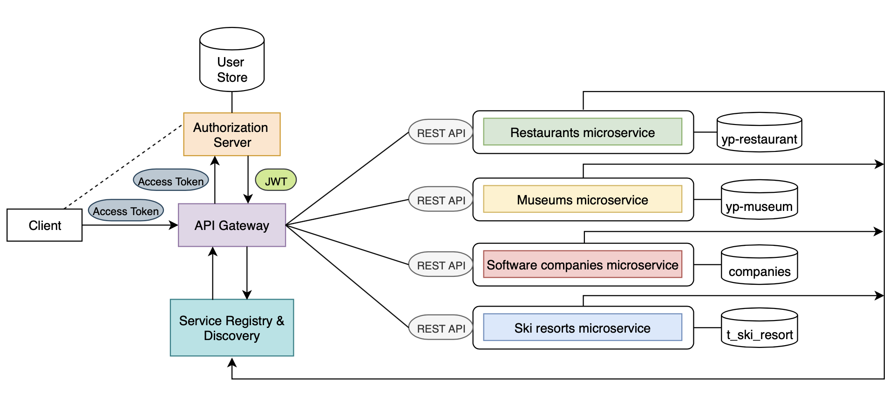
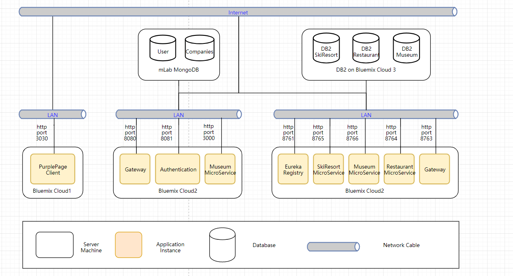
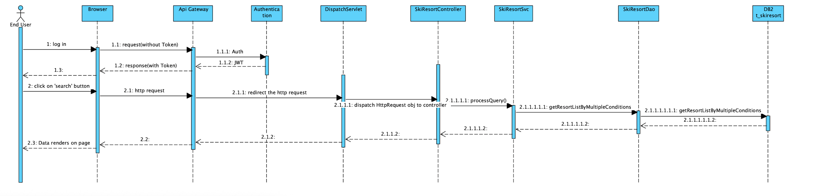
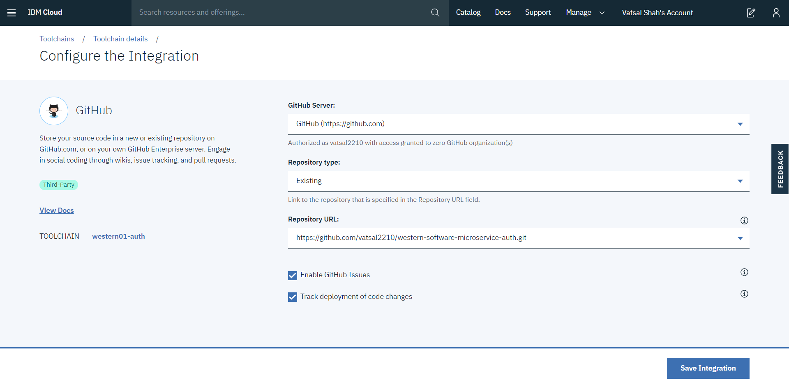
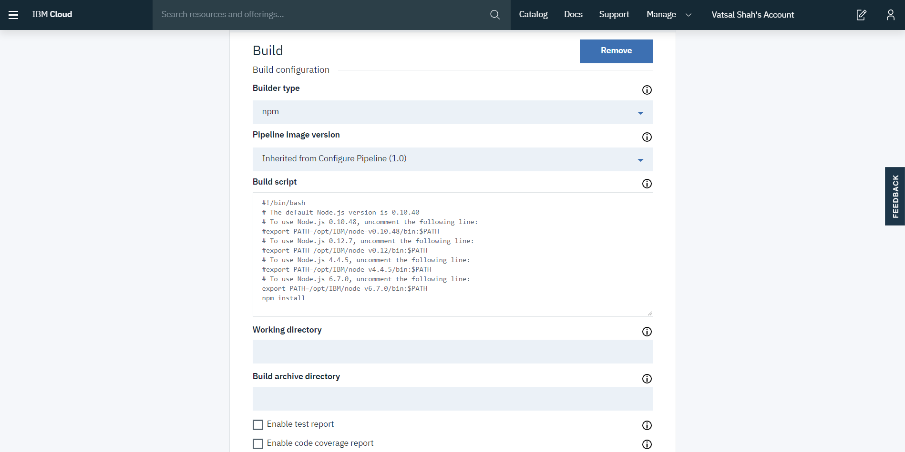
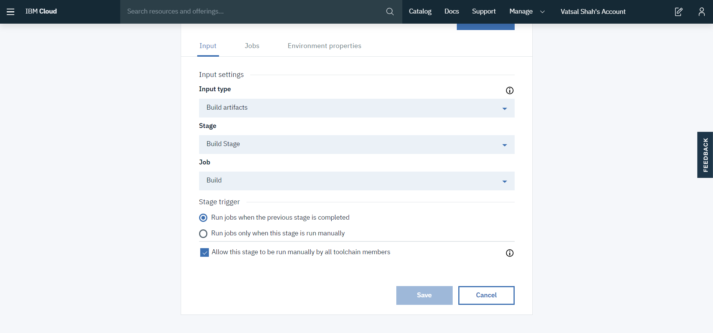
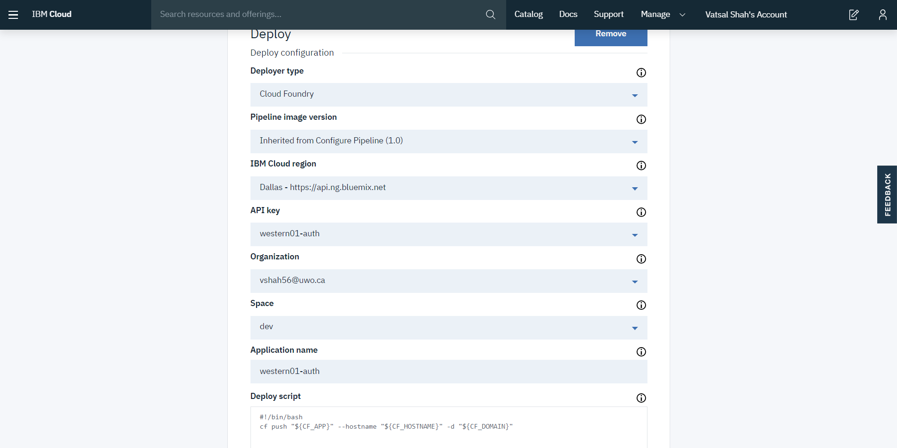

# Software-Design-Architecture-And-Microservices
Software Design and architecture project with microservices. 

## How to use this repository?

- Code: All microservices code (Auth, Gateway, UI and other microservices)
- Presentation: `Software Architecture Evaluation and Comparison`
- Final Report
- Final Presentation
- Video Overview - Working video

## Description

Software-oriented architecture is best depicted with layers. In the beginning, end-user's edge launches a client layer (i.e. website, app). Client layer securely communicates with a gateway sending over authentication token. Gateway requests Auth Service and certain middleware to authorize the authentification. Upon success, user is granted access to the protected layer. Protected layer consists of all microservices offered by the system. Each microservice may be connected with a database and\or other services. Service Registry and Discovery keeps track of 'healthiness' (live/dead) of the microservices.

## Tools and Technologies

- Frontend is built using `React`, `JavaScript`, `HTML`, `CSS`. 
- Backend is built using `Node.js`, `Express`, `MongoDB`, `SpringCloud`, `DB2 database`, `MyBatis`. 
- Services are deployed on `Bluemix `leveraging Toolchains and Pipelines.

## Installation Steps

### Node.js - Gateway & Authentication app
- **`Code`** and install all microservices
- Download the code. 
- Run `npm install`
- Run `npm start` to start all the services.

## Views

### Component-and-Connector View

#### Client layer
- Client layer is accessed from an edge - native platform or standalone browser 
- The client (instance of client layer) sends its token put in header to Gateway  
- Client layer handles authentification response from the access layer granting certain access rights to the user
- Authenticated users only can access microservices

#### Access Layer
- Access layer is composed of Gateway and Authentication services
- Gateway handles requests from all clients, communicates with authentication service
- Valid token is verified with Authentication service and the client is grante access to protected layer and microservices. 
- Missing or invalid token results in non-authentificated user response 
- Microservices communicate with clients via Protected layer

#### Protected layer
- Elements under the protected layer can be accessed only via Gateway of Access Layer
- Client originated requests flow through Access layer whereby are routed by the gateway to corresponding services based on the entries in Registry
- After processing, microservice-generated responses hit the protected layer and then are transmitted to client via the gateway 
- In essense, the protected layer is veiled behind the access layer. (That's why it's **protected**!)
- - All microservices run logging system, so that if microservice goes offline (due to maintenance, failure, etc.), the function of that element is automatically decommissioned in the registry and, subsequently, in API gateway
- Similarly, administrator can add/remove elements in the protected layer seemlessly. Such flexibility is provided by design

#### Service Registry & Discovery
- Service Registry and Discovery come from , and are implemented with Java Spring
- Discovery part listens for heartbeat of registries in order to maintain up-to-date 'healthiness' of microservices
- At the same time, in terms of making sure synchronization, the registry will check the status of microservices positively 
- Finally, Gateway can retrieve the Registry & Discovery service current status to the frontend

#### Variability Guide
- In case gateway configuration changes, client connection is broken-down. All the services end-points are defined on Gateway. Thus, if any microservice API-endpoints are modified it is necessary to update the gateway configuration
- In case database connection configuration (login credentials, URL or database name) changes, each dependant microservice necessarily requires re-configuration

## Deployment View

- Both  Cloud2 and Cloud3 are in charge of certain microservices. For the Cloud2, there are: Gateway, Authentication, Company Microservice, all of which are implemented in NodeJS, and connect to mLab MongoDB that has two (user, companies) tables.
- Authentication service shares the same database with login and signup functions. For this part, it is deployed on bluemix, but IBM designed it with compatibility in mind, so that it can be deployed on any system, environment or cloud platform. 
- The last deployment part, includes Microservice Registry, Request Gateway, three microservices are likewise deployed on bluemix. All Eureka clients consisting of three microservices and gateway will send a 'heartbeat' to notify the action of registering and in Eureka server will check whether the service is still alive periodically.  

### Sequence Diagram

1. End user represents an individual initiating a sequence to achieve the end result
2. Browser is an edge instance through which the end user interacts with the application, transmitting information
3. API Gateway serves to handle requests from the Browser, fetching appropriate responses, while structurizing the system architecture
4. Authentication authorizes the user granting\restricting\denying access to underlying services
5. DispatchServlet associates gateway with service controller, opening communication channel 
6. SkiResortController processes transmitted query to assign it with an instance of SkiResortSvc
7. SkiResortSvc polymorphically appropriates required method to SkiResortDao class instance, which ultimately retrieves data from the DB2 t_skiresort.

### Bluemix:
- Step 1: Create a toolchain with `Build your own toolchain`
- Step 2: Add tools - Github + Delivery pipeline
- Step 3: Github configuration as below:
    

- Step 4: Delivery pipeline: Create two stage: Build & Deploy
- Step 5: Build stage configuration as below:

    
    

- Step 6: Deploy Stage configuration as below:
    
    
    

## Directory -- Index, Glossary, Acronym List

Glossary and Acronym List 
-	: Application Programming Interface, a set of functions allowing for the access of features of a system
-	C&C View: Component and connector view
-	: Data Access Object, an object that provides an abstract interface to some type of database, providing specific data operations without exposing the details of the database
-	DB: Database
-	: Relational Database Management System from IBM 
-	: protocol defines how messages are formatted and transmitted, and what actions Web servers and browsers should take in response to various commands
-	: Java Database Connectivity is an API for the programming language Java, which defines how a client may access a database.
-	: JSON Web Tokens, used for securing our application through JSON-based tokens
-	Middleware: A bridge between gateway and authentication service
-	: Model-View-Controller, design pattern for the separation of data and views
-	: Representational State Transfer, a software architectural style that defines a set of constraints to be used for creating Web services 
-	: Service-Oriented Architecture, involves the deployment of services, which are units of logic that run in a network
-	: User Interface, the medium which the user interacts with the application
-	: Uniform Resource Locator, colloquially termed a web address, is a reference to a web resource

## Author

**Vatsal Shah**

[**PORTFOLIO**](https://vatsalshah.in)

[**GITHUB**](https://github.com/vatsal2210)

[**BLOG**](https://medium.com/@vatsalshah2210)

If you like my stuff and hate spam, I can send my upcoming articles to your inbox. One-click unsubscribe anytime — [**Click here to join my newsletter**](https://vatsalshah.substack.com/subscribe) 💌

If you’re feeling generous today, you can [**buy me a coffee**](https://www.buymeacoffee.com/vatsalshah) ☕
